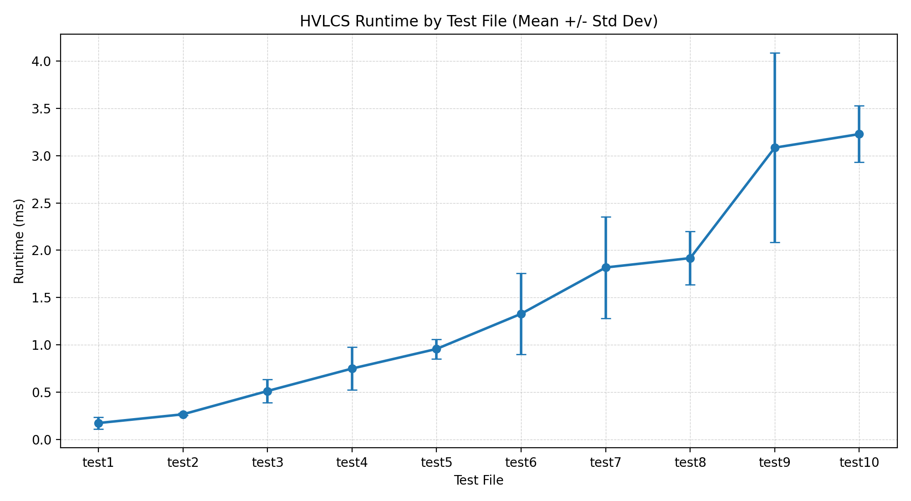
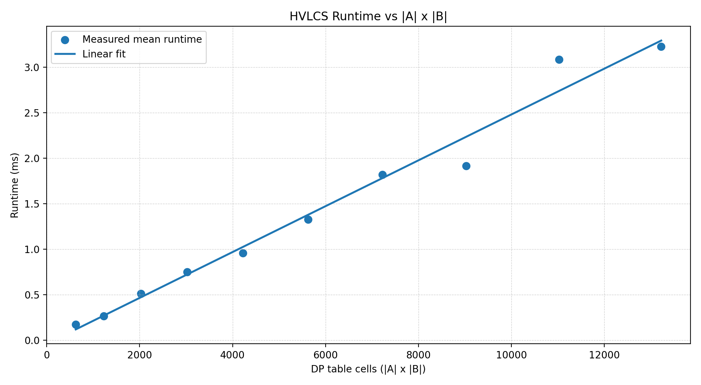

# Highest Value Longest Common Sequence

## Student Info

- Emily Apel UFID: 34845199
- Hiral Shukla UFID: 42066733

## Compile / Build

This project is Python-based and does not require a compile step.

Environment used:
- Python 3.13+

Required package for plotting:
- matplotlib

Install dependency:

```bash
python -m pip install matplotlib
```

## How to Run

Run one input file:

```bash
python src/hvlcs.py <input_file.in> <output_file.out>
```

Example:

```bash
python src/hvlcs.py example.in example.out
```

Run all 10 test files:

```bash
python tests/run_all_tests.py
```

Run all tests and generate runtime plots:

```bash
python tests/run_all_tests.py --graph
```

Generate runtime plots directly (with repeated measurements):

```bash
python tests/graph.py --repeats 10
```

Generated runtime artifacts:
- tests/runtime_results.csv
- tests/runtime_graph.png
- tests/runtime_vs_size.png

## Assumptions

1. Input format is:
- First line: alphabet size `k`
- Next `k` lines: `<symbol> <value>`
- Next line: string `A`
- Next line: string `B`
2. Every character that appears in `A` or `B` has a value defined in the alphabet map.
3. All symbol values are integers.
4. Strings are case-sensitive.
5. The algorithm computes the maximum total value of a common subsequence using dynamic programming.
6. Runtime graphs in Question 1 measure the DP computation in-process (minimizing process startup overhead) and use repeated runs to reduce noise.

## Question 1: Emperical Comparsion

We used 10 nontrivial input files in data/test1.in through data/test10.in.
All test strings have length at least 25, and sizes were stepped to increase `|A| x |B|` from 625 to 13225.

Method:
1. For each test file, run the DP computation 10 times.
2. Record mean runtime, standard deviation, min, and max in tests/runtime_results.csv.
3. Plot:
- Runtime by test file with error bars (tests/runtime_graph.png)
- Runtime vs `|A| x |B|` with linear fit (tests/runtime_vs_size.png)

Runtime by test file (mean +/- standard deviation):



Runtime vs input size `|A| x |B|` with linear fit:



Observation:
- Runtime generally increases as `|A| x |B|` increases.
- The runtime-vs-size plot is approximately linear, matching the expected `O(nm)` behavior of the DP algorithm.
- Some variance remains due to normal machine/runtime noise, but repeated runs and error bars show a consistent upward trend.

## Question 2: Reccurence Equation

Give a recurrence that is the basis of a dynamic programming algorithm to compute the HVLCS of strings *A* and *B*. You must provide the appropriate base cases, and explain why your recurrence is correct.

Let $w(c) = \text{alphabet}[c]$ be the weight of character $c$.

$$OPT(i,j) = \begin{cases} 
0 & \text{if } i = 0 \text{ or } j = 0 \\ 
w(A[i]) + OPT(i-1,j-1) & \text{if } A[i] = B[j] \\ 
\max(OPT(i-1,j),\ OPT(i,j-1)) & \text{if } A[i] \neq B[j] 
\end{cases}$$

The recurrence is correct because it covers all possible cases. When either string is empty there is no common subsequence, so the weight is 0. When characters match, we always take them since all weights are positive, adding w(A[i])w(A[i])
w(A[i]) to the best solution of the remaining subproblem. When characters don't match, we can't include both, so we take the max of skipping one or the other.

## Question 3: Big-Oh

Give pseudocode of an algorithm to compute the length of the HVLCS of given strings *A* and *B*. What is the runtime of your algorithm?

```
HVLCS(A, B, w):
    n = len(A)
    m = len(B)
    
    for i = 0 to n:
        M[i][0] = 0
    for j = 0 to m:
        M[0][j] = 0
    
    for i = 1 to n:
        for j = 1 to m:
            if A[i] == B[j]:
                M[i][j] = w(A[i]) + M[i-1][j-1]
            else:
                M[i][j] = max(M[i-1][j], M[i][j-1])
    
    return M[n][m]
```
**Runtime:** $O(nm)$ — there are $n \times m$ subproblems and each takes $O(1)$ to compute, giving $O(nm)$ overall.
